# Aurelia

Beautiful on-screen flyouts for Windows — volume, media, brightness, airplane mode and lock keys,
in translucent glass instead of the plain grey box Windows shows you.

[](https://github.com/hasan-ismail/Aurelia/actions/workflows/build.yml)
[](https://github.com/hasan-ismail/Aurelia/releases/latest)
[](https://github.com/hasan-ismail/Aurelia/releases)
[](LICENSE)

Press a volume, media or brightness key and Windows shows a small popup in the corner. Aurelia
replaces it with something worth looking at — real media controls, a proper volume slider, a live
seek bar, per-display brightness, and a glass surface that catches the light as your cursor moves
across it.

Your built-in flyout isn't modified. It's hidden while Aurelia is running, and Windows goes straight
back to normal when you quit.

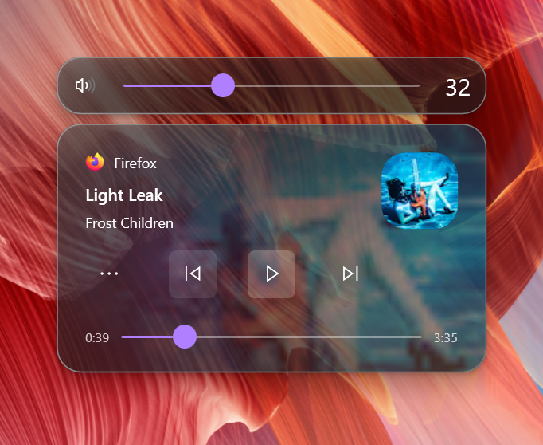

## Install

Download the latest build from the [Releases page](https://github.com/hasan-ismail/Aurelia/releases/latest).

| | |
| --- | --- |
| **Installer** (recommended) | `Aurelia-Setup-x64.exe` — no admin prompt, Start Menu entry, optional start-with-Windows, clean uninstall |
| **Portable** | `Aurelia-portable-win-x64.zip` — unzip and run, nothing written outside the folder |
| **ARM devices** | Use the `arm64` build (Surface Pro X, Snapdragon laptops) |

No certificate to install and no separate .NET download — the runtime is bundled.

Aurelia runs in your system tray. Double-click the icon for settings, or right-click for Settings
and Exit.

**Requires Windows 10 1809 or newer, or Windows 11.**

## Themes

Nine built-in looks — **Classic, Frost, Midnight, Aurora, Ember, Nord, Rose, Vapor, Mono** — each
setting an accent colour, how solid the glass is, how round the corners are, and light or dark.

A theme is a starting point, not a cage. Pick one, then change anything you like: accent colour by
swatch or hex, glass opacity, corner roundness, light or dark. The moment you adjust something it
simply reads as Custom.

| | | |
|:-:|:-:|:-:|
| **Classic** | **Frost** | **Midnight** |
| 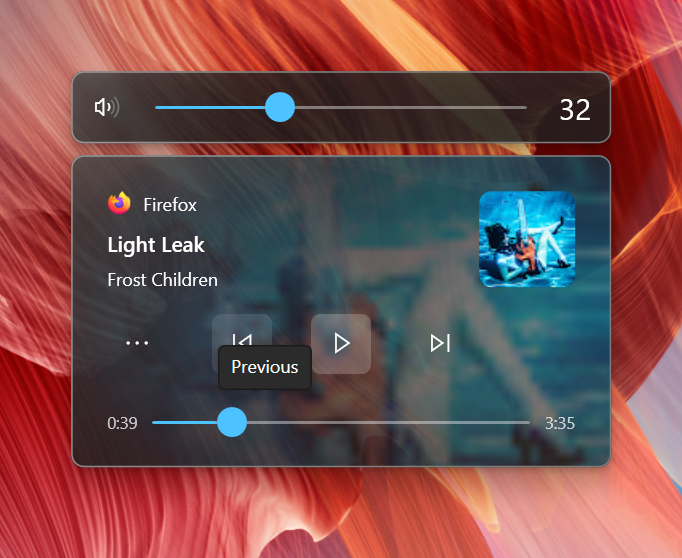 |  | 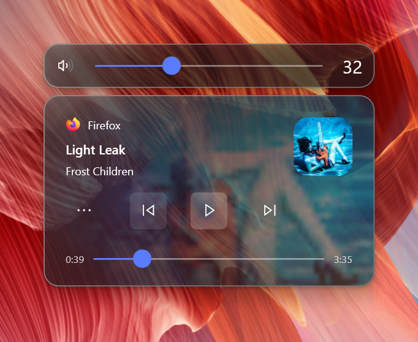 |
| **Aurora** | **Ember** | **Nord** |
| 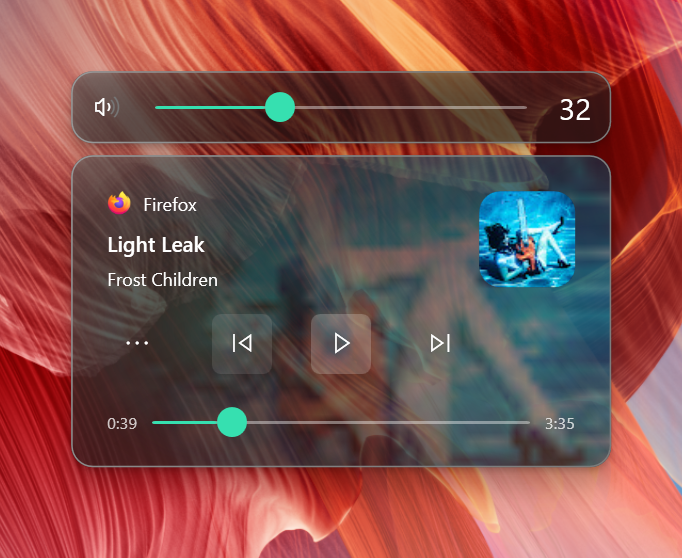 | 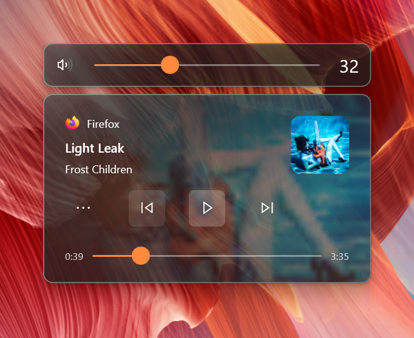 | 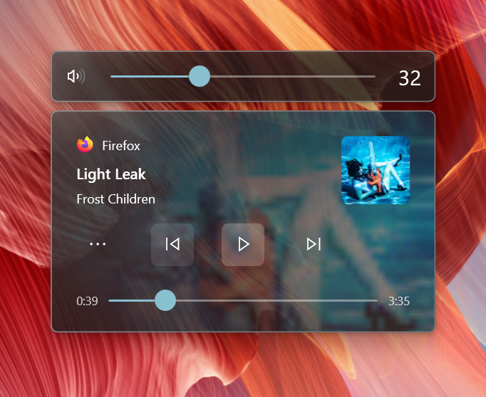 |
| **Rose** | **Vapor** | **Mono** |
| 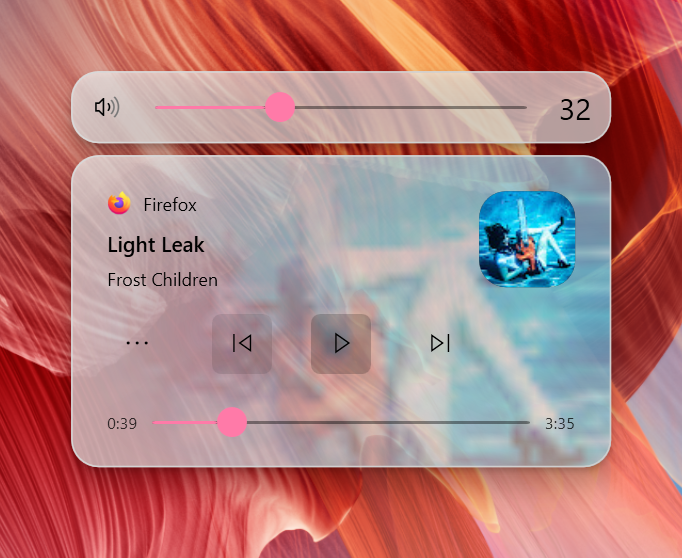 |  | 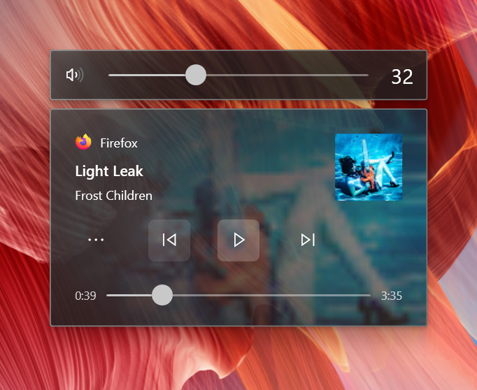 |

Pick a theme, then tune it — or ignore the presets entirely and set the accent by hex:

| Themes | Colours and glass |
|:-:|:-:|
| 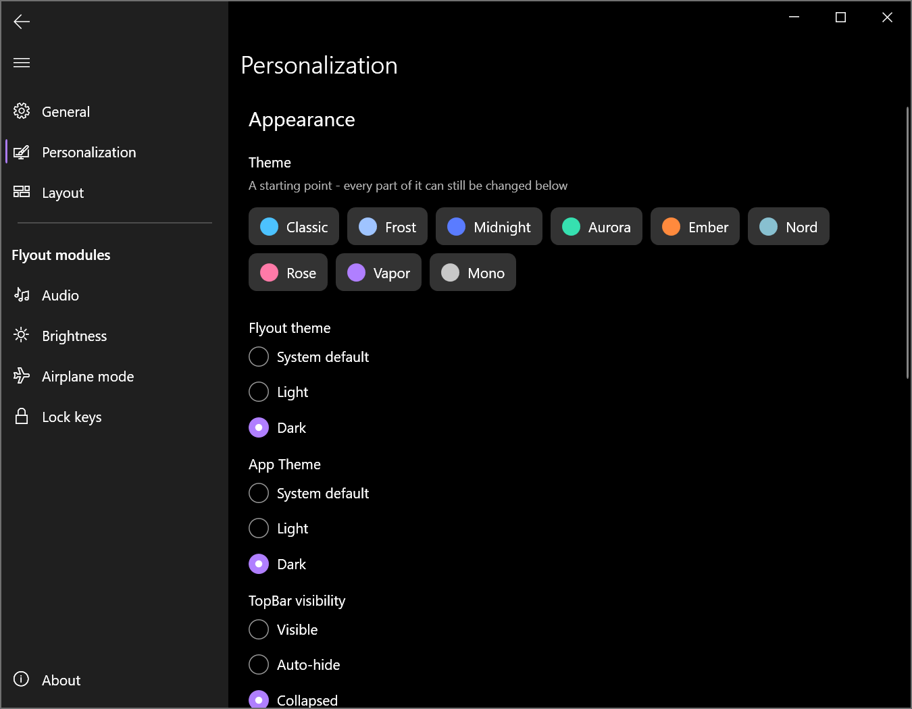 | 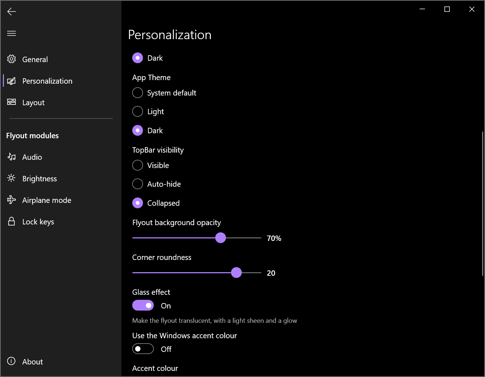 |

## Features

**Flyouts**

- **Volume** — a real slider, click the icon to mute, scroll to adjust
- **Media** — play/pause, next/previous, shuffle, repeat, stop, and a seek bar that actually moves
- **Brightness** — per display, with a link button to move them together or set them apart
- **Airplane mode**
- **Lock keys** — Caps Lock, Num Lock, Scroll Lock and Insert/Overtype

**Appearance**

- Translucent glass with a specular sheen and a lit rim, or a flat surface if you prefer
- A highlight that follows your cursor across the flyout
- Slider thumbs that grow under the pointer
- Light and dark, following Windows or pinned
- Adjustable opacity and corner roundness
- Drag it anywhere — it remembers where you put it
- Choose which monitor it appears on
- Configurable timeout, alignment and stacking direction

**Behaviour**

- Every module can be turned off individually
- Or turn the whole thing off and get the Windows flyouts back, without uninstalling
- Start with Windows, optional
- Animations honour the Windows "Show animations" accessibility setting
- Translated into 30+ languages

Lock keys get their own compact flyout:

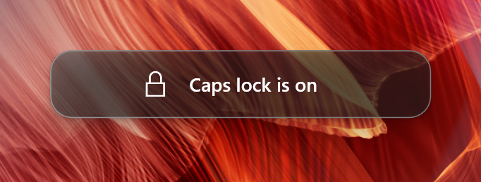

Everything is configurable, per module:

| General | Layout |
|:-:|:-:|
| 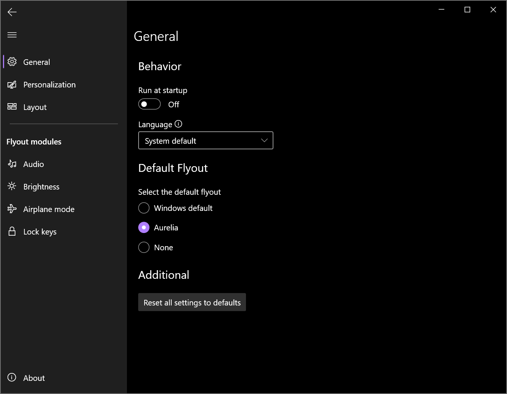 | 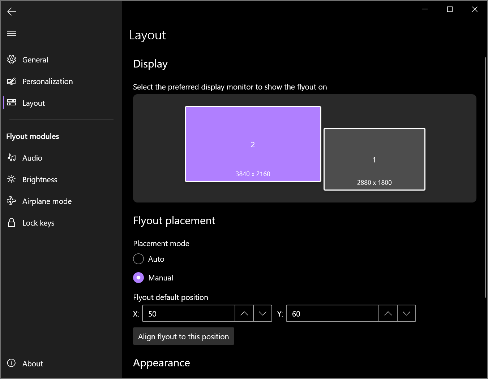 |

Media controls depend on what the playing app reports to Windows. See
[which players support what](docs/GSMTC-Support-And-Popular-Apps.md).

> There's no flyout for keyboard backlight or the Fn key. Those aren't key presses — they're
> hardware signals handled by your OEM's driver, so no application can see them.

## Privacy

No analytics, no crash reporting, no telemetry, no network requests. Your settings stay on your
machine. See [Privacy.md](Privacy.md).

## Building

You need the [.NET 9 SDK](https://dotnet.microsoft.com/download/dotnet/9.0). Visual Studio is not
required.

```bash
git clone https://github.com/hasan-ismail/Aurelia.git
cd Aurelia

# run it
dotnet run --project Aurelia/Aurelia.csproj -p:Platform=x64

# or build the portable output the releases use
dotnet publish Aurelia/Aurelia.csproj -c Release -r win-x64 --self-contained true -p:Platform=x64 -o out
```

## Contributing

Bug reports and pull requests are welcome — see [CONTRIBUTING.md](CONTRIBUTING.md). When reporting a
problem, please include your Windows build number (`winver`); it matters more than you'd think for
this app.

## Credits

Aurelia takes its inspiration from [ModernFlyouts](https://github.com/ModernFlyouts-Community/ModernFlyouts)
by [ShankarBUS](https://github.com/ShankarBUS/) and its contributors, which itself grew out of
[AudioFlyout](https://github.com/ADeltaX/AudioFlyout) by [ADeltaX](https://github.com/ADeltaX/).
Aurelia shares MIT-licensed code with that lineage, so their copyright notices are kept in
[NOTICE.md](NOTICE.md). Thanks to everyone who worked on them.

Built with [NAudio](https://github.com/naudio/NAudio),
[ModernWpf](https://github.com/Kinnara/ModernWpf) and
[Hardcodet.NotifyIcon.Wpf](https://github.com/hardcodet/wpf-notifyicon).
Third-party licences are listed in [NOTICE.md](NOTICE.md).

## License

Aurelia is free software under the **[GNU Affero General Public License v3.0](LICENSE)**.

You can use it, study it, change it and share it. If you distribute a modified version — or run one
where other people can interact with it over a network — you have to offer them the source of your
version under the same licence.

Parts of Aurelia derive from MIT-licensed projects. MIT allows redistribution under the AGPL as long
as the original notices travel with the code; those notices are in [NOTICE.md](NOTICE.md) and
continue to govern those portions. Every package Aurelia depends on is MIT-licensed.
